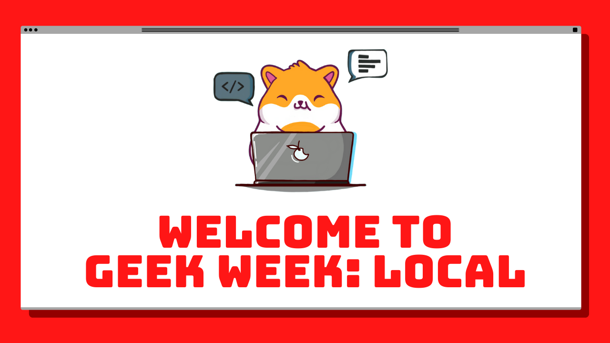
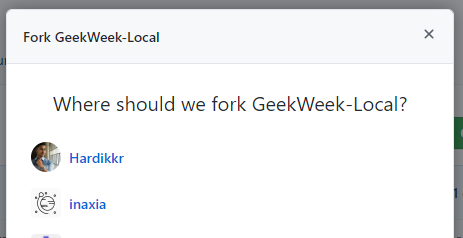
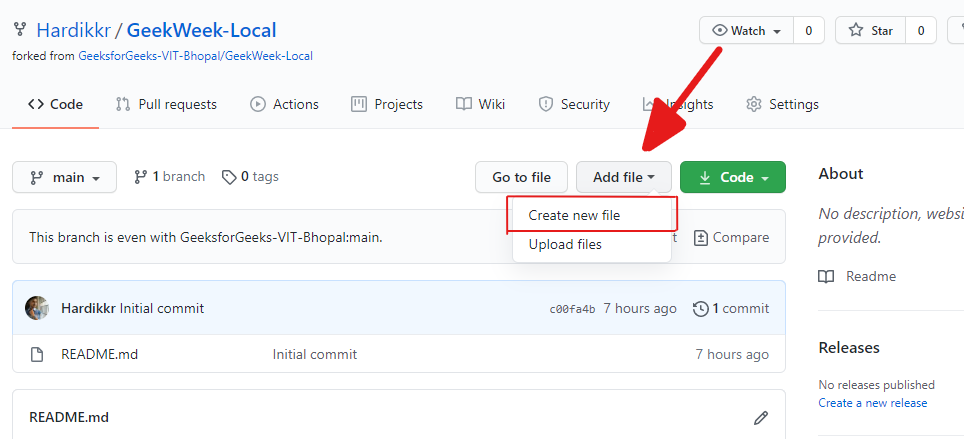
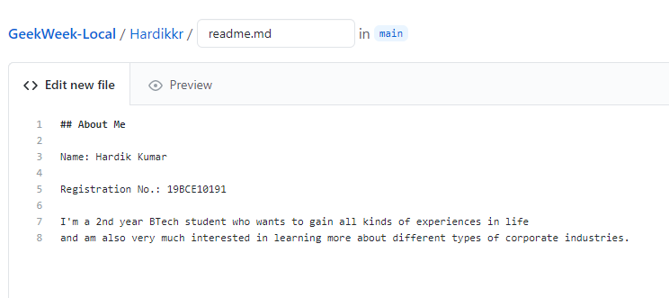
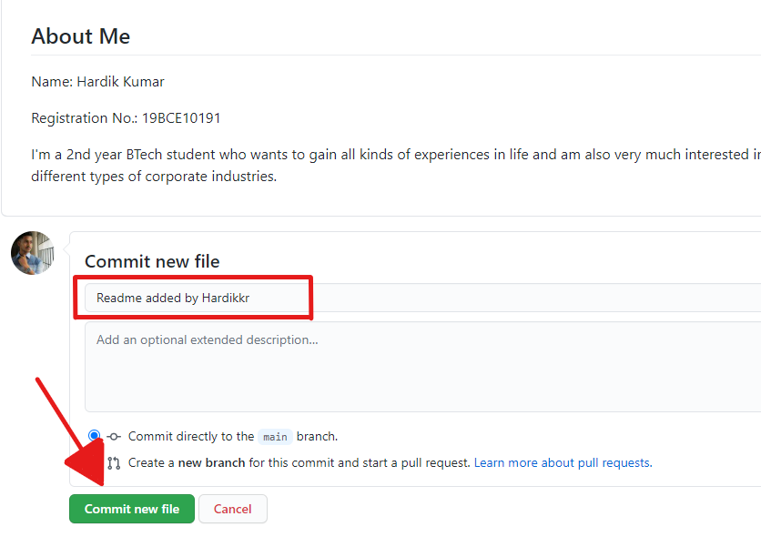
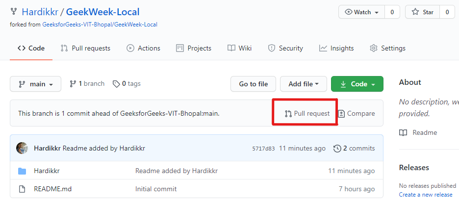
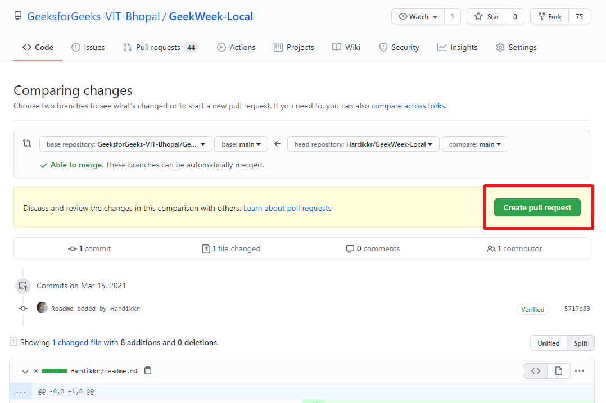
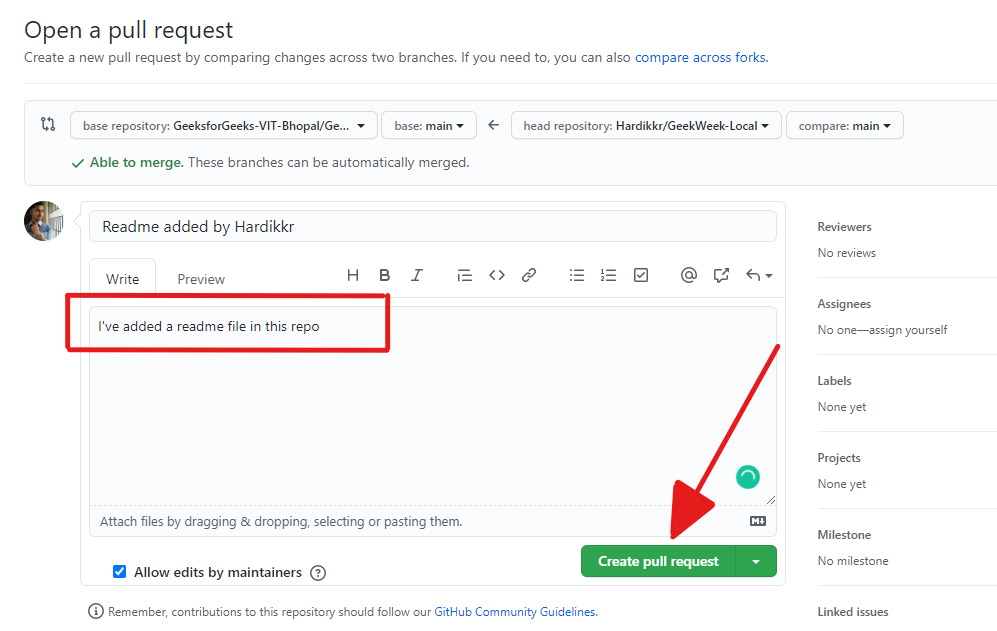

# Geek Week: Local

## What's Geek Week: Local?
Geek Week: Local is a week-long hackathon of creating hacks, solving problems, and building profiles both big and small. Choose between daily and week-long challenges that vary in difficulty, so whether this is your first time coding or you’re a seasoned expert, Geek Week has something for you. The more challenges you conquer, the more points you’ll earn and make your position on the leader-board.

## What are these Challenges?
Geek Week: Local will run from 14/03/21 to 21/03/21.

During this time, you can expect challenges for all skill levels. These challenges can be completed on your own time, and new ones will be released each day on our website! Once the daily challenges are announced, you’ll have 24 hours to complete and submit them in order to
earn those points on the leader-board.

If the daily challenges aren’t quite your speed, there will also be plenty of week-long challenges you can complete at any time. These will range from quick technical challenges to tasks you can complete with your guild-mates (guild=team), both beginner-friendly and technically advanced so there is something for everyone.

.png)

## **Step1:** Goto **[Geek Week: Local](https://github.com/GeeksforGeeks-VIT-Bhopal/GeekWeek-Local)** and click on **Fork** on the top right corner inside the GeekWeek-Local repo

## **Step2:** Choose the account you want the forked repo to be in

## **Step3:** Click on **Add file** and select *Create new file*

## **Step4:** Now name the file as **username/readme.md** and write a few lines about yourself

## **Step5:** Write a commit message and click on **Commit new file**

And now you can add all other files inside your **username**'s folder

.png)

## **Step1:** Goto **Geek Week: Local** repo in your profile and click on **Pull request** as shown in the image below

## **Step2:** Now you can see all the changes that you've made. Then click on **Create pull request** as shown in the image below

## **Step3:** Now, just write a title and a description of what this Pull request is for. Then click on **Create pull request**

